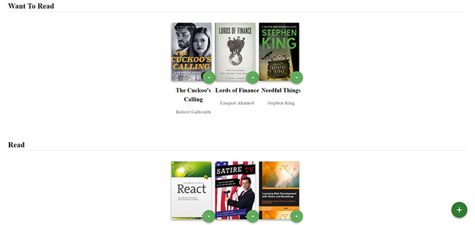

# Udacity React ND 1st project  - MyReads

~~Live demo - https://madbence-readable.herokuapp.com/~~

A bookshelf app in react from 2018's 4 month Udacity React bootcamp.

Intro to class components, props and state.

Archived, depcrecated, Heroku free dynos gone. 6 years old legacy React stuff. Still runs perfectly on localhost with node 16.2.
